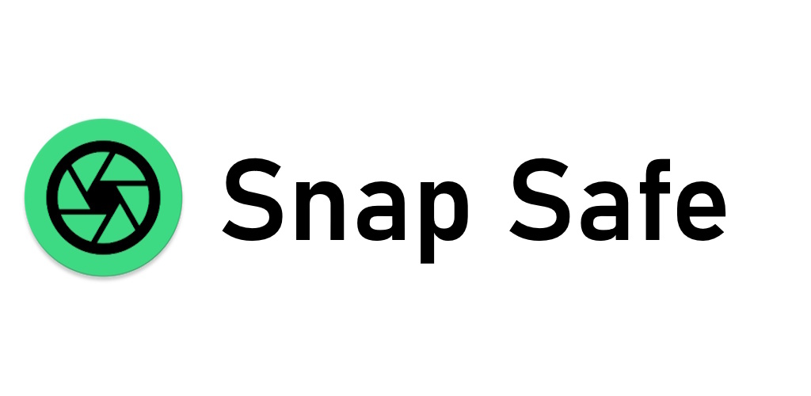

# SnapSafe
*The camera that minds its own business.*

_Available on:_

[snapsafe.org](https://snapsafe.org/)

----

## Why SnapSafe?

**SnapSafe** is a camera app that has been engineered from the ground up to protect your photos.

Attacks come in many forms, from accidental swipes, to intrusive surveillance, and even malicious code.
**SnapSafe** can protect your photos from all angles.

### Key Features

* 🔒 **Zero‑Leak Design** – The app has no internet access; android backups are prevented..
* 🛡️ **Fully Encrypted** – Shots are written to encrypted, app‑private storage.
* 🔢 **PIN‑Locked Gallery** – A separate PIN stands between curious thumbs and your photos.
* 📤 **Secure Sharing** – Metadata is scrubbed and filenames are randomized when you share.
* 😶‍🌫️ **Auto-Face Blur** – Obfuscate faces automatically with our secure blur algorithm.
* 🗺️ **Granular Location** – Add coarse, fine, or zero location data—your call.
* ☠️ **Poison Pill** – Set a special PIN, that when entered, appears to work normally but actually deletes your existing
  photos.
* 🎭 **Decoy Photos** – Select innocuous decoy photos, these will be preserved when your Poison Pill is activated.
* 👀 **100 % Open Source** – Auditable code in plain sight.

### On the Roadmap

* Encrypted video recording. _Maybe._
* Improved photo-taking experience

## Read our papers on SnapSafe

- [Security Design](docs/SnapSafe%20Security%20on%20Android.md)
- [Attack Vectors](docs/SnapSafe%20Attack%20Vectors.md)
- [Related Incidents](docs/SnapSafe%20Related%20Incidents.md)

---

## 🪨 Dark Rock Studios

[**Dark Rock Studios**](https://darkrock.studio/) is all about building **Free and Open Source Software**.

🐛 Found bugs?  
💡 Have suggestions?  
📚 Want to help translate?  
🎮 Interested in our other apps?  
👉 Join our community of Open Source enthusiasts on [**Discord**](https://discord.gg/ju2RQa5x8W)!

---

## License

SnapSafe is released under the [MIT License](LICENSE). Use it, fork it, improve it—just keep it open.

---

## Privacy

Our full, ultra‑brief Privacy Policy lives in [PRIVACY.md](PRIVACY.md). Spoiler: we collect nothing.

---

## Development

See [docs/HOW-TO-RELEASE](docs/HOW-TO-RELEASE.md) on how to publish a new release.

### Contributing

Pull requests are happily accepted.

Start with an issue or draft PR and we can talk it through.
