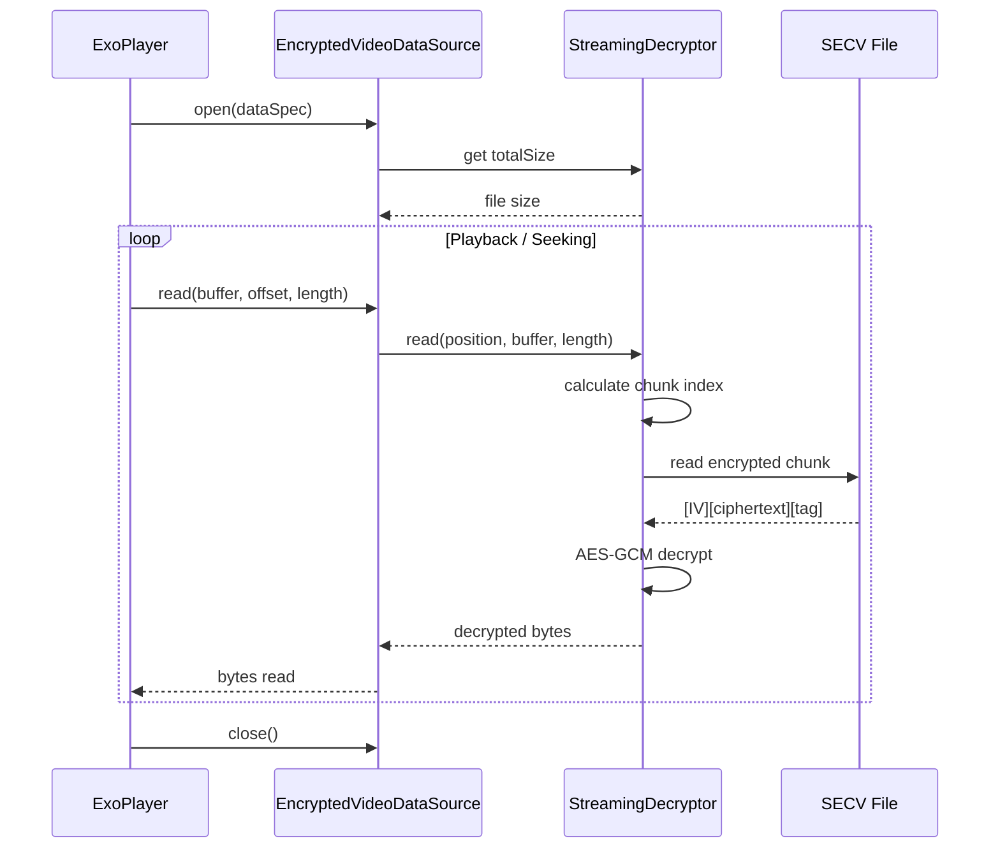

# Video Encryption in SnapSafe

This document describes the SECV (Secure Encrypted Camera Video) file format and the philosophy behind video capture and
encryption in SnapSafe.

## The Challenge

Video encryption presents unique challenges compared to photo encryption:

1. **Memory constraints**: Videos can be gigabytes in size - loading an entire video into memory for encryption is not
   feasible on mobile devices.

2. **CameraX limitations**: Android's CameraX `Recording` API writes directly to a file. There's no byte stream access
   during recording, so we cannot encrypt on-the-fly during capture.

3. **Playback requirements**: Videos need random access for seeking. Traditional stream ciphers don't support this well.

4. **Authentication**: AES-GCM computes its authentication tag over the entire message. A single-shot approach would
   require reading the entire file twice (encrypt, then authenticate).

## Our Approach: Chunked Post-Recording Encryption

We use a chunked encryption strategy:

1. **During recording**: CameraX writes to a temporary unencrypted `.mp4` file in app-private storage (protected by
   Android's File-Based Encryption).

2. **After recording**: We stream-encrypt the temp file in 1MB chunks, each with its own IV and authentication tag.

3. **Cleanup**: The temp file is deleted after encryption completes.

4. **Playback**: ExoPlayer uses a custom `DataSource` that decrypts chunks on-the-fly, enabling seeking without
   decrypting the entire file.

### Why Post-Recording?

We considered several alternatives:

- **Real-time encryption**: Not possible with CameraX's file-based recording API.
- **Custom camera implementation**: Would sacrifice quality, stability, and features that CameraX provides.
- **Memory-mapped encryption**: Still requires the entire file in virtual memory space.

Post-recording encryption is a pragmatic trade-off. The temp file exists unencrypted briefly, but only in app-private
storage which is already protected by Android FBE when the device is locked. This is the real security boundary - not
file deletion.

## SECV File Format

```
+--------------------------------------------------+
|                  HEADER (64 bytes)               |
+--------------------------------------------------+
| Magic: "SECV"              | 4 bytes             |
| Version                    | 2 bytes (uint16)    |
| Chunk Size                 | 4 bytes (uint32)    |
| Total Chunks               | 8 bytes (uint64)    |
| Original Size              | 8 bytes (uint64)    |
| Reserved                   | 38 bytes            |
+--------------------------------------------------+
|              CHUNK INDEX TABLE                   |
|         (12 bytes per chunk)                     |
+--------------------------------------------------+
| Chunk 0: Offset (8) + Encrypted Size (4)        |
| Chunk 1: Offset (8) + Encrypted Size (4)        |
| ...                                              |
| Chunk N: Offset (8) + Encrypted Size (4)        |
+--------------------------------------------------+
|              ENCRYPTED CHUNKS                    |
+--------------------------------------------------+
| Chunk 0: [IV 12B][Ciphertext][Auth Tag 16B]     |
| Chunk 1: [IV 12B][Ciphertext][Auth Tag 16B]     |
| ...                                              |
+--------------------------------------------------+
```

### Design Rationale

**Fixed header size (64 bytes)**: Allows quick validation and metadata extraction without parsing variable-length
structures.

**Chunk index table**: Enables O(1) seeking. To play from position X, we calculate which chunk contains X, look up its
offset in the index, and decrypt just that chunk.

**Per-chunk IV**: Each chunk gets a fresh 12-byte IV from `SecureRandom`. This prevents nonce reuse even across millions
of chunks.

**Per-chunk authentication**: Tampering is detected at the chunk level. A corrupted chunk fails authentication without
invalidating the entire file.

**1MB default chunk size**: Balances memory usage against seek granularity. Smaller chunks mean finer seeking but more
overhead; larger chunks reduce overhead but increase memory pressure during decryption.

## Encryption Details

- **Algorithm**: AES-256-GCM
- **Key**: Derived from user PIN using PBKDF2 (same as photo encryption)
- **IV**: 12 bytes, randomly generated per chunk
- **Authentication tag**: 16 bytes (128-bit), appended to ciphertext

Each chunk is independently encrypted:

```
ciphertext = AES-GCM-Encrypt(key, iv, plaintext_chunk)
stored = iv || ciphertext || auth_tag
```

## Playback Architecture



The `StreamingDecryptor` maintains a single-chunk cache, so sequential reads (normal playback) don't re-decrypt the same
chunk repeatedly.

## Security Considerations

### Temporary File Exposure

The unencrypted temp file exists during recording and until encryption completes. After deletion, the data may persist
on flash storage due to wear leveling until the SSD controller garbage collects those blocks.

**Why we don't attempt "secure deletion"**: On flash storage (SSDs, eMMC, UFS), overwriting a file with zeros doesn't
overwrite the original physical cells. The storage controller maps the write to new blocks and marks the old ones for
eventual garbage collection. "Secure deletion" via overwriting is ineffective on modern storage.

**Actual mitigations**:

1. **App-private storage**: Only accessible to SnapSafe (unless device is rooted).
2. **Android FBE (File-Based Encryption)**: On devices with FBE (Android 7+), app storage is encrypted with a key
   derived from the user's lock screen credential. When the device is locked, app files are cryptographically
   inaccessible - including any remnant temp file blocks.
3. **Minimal window**: Encryption starts immediately after recording stops.

### Chunk-Level Tampering

An attacker with file access could:

- Reorder chunks (detected: playback produces garbage)
- Truncate file (detected: missing chunks)
- Modify chunk data (detected: GCM authentication failure)

They cannot:

- Read video content without the key
- Forge valid chunks without the key
- Silently corrupt data (authentication prevents this)

### Key Management

Video encryption uses the same derived key as photo encryption, managed by `ShardedKey` for in-memory protection. The
key is never written to disk in plaintext.

## File Extension

Encrypted videos use the `.secv` extension (Secure Encrypted Camera Video). The gallery recognizes both `.secv` (
encrypted) and `.mp4` (legacy/fallback) files.

## Future Considerations

- **Hardware-accelerated encryption**: Could reduce encryption time on supported devices.
- **Thumbnail embedding**: Store an encrypted thumbnail in the header to avoid decrypting video data for gallery
  previews.
- **Streaming during recording**: If CameraX adds byte-stream access, we could encrypt during capture.
